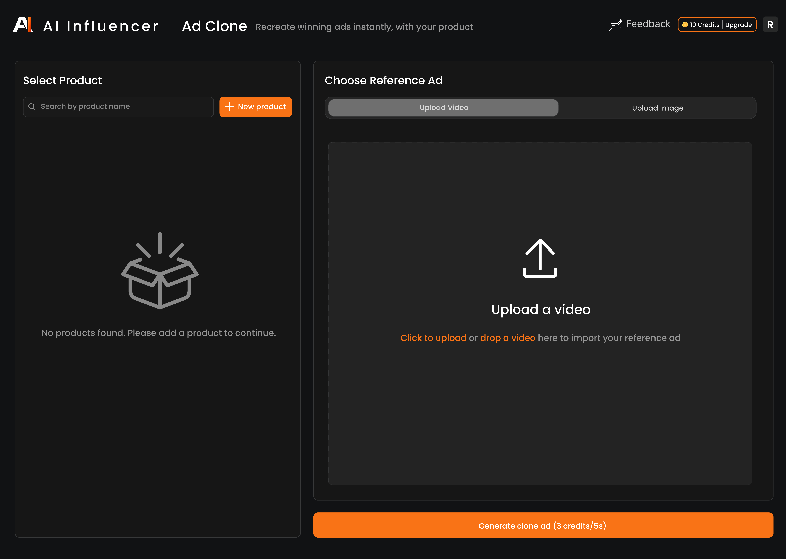
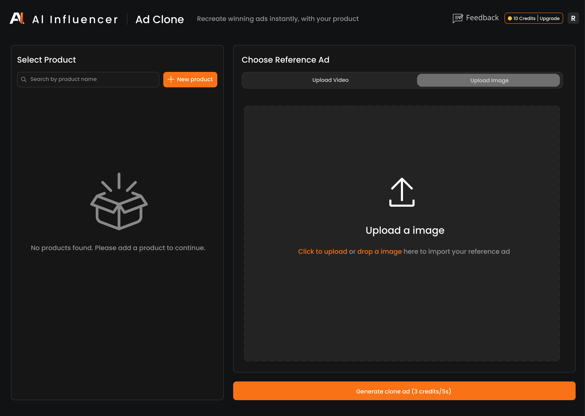
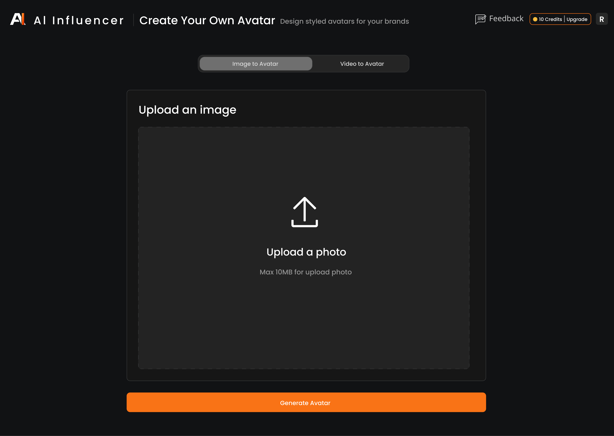
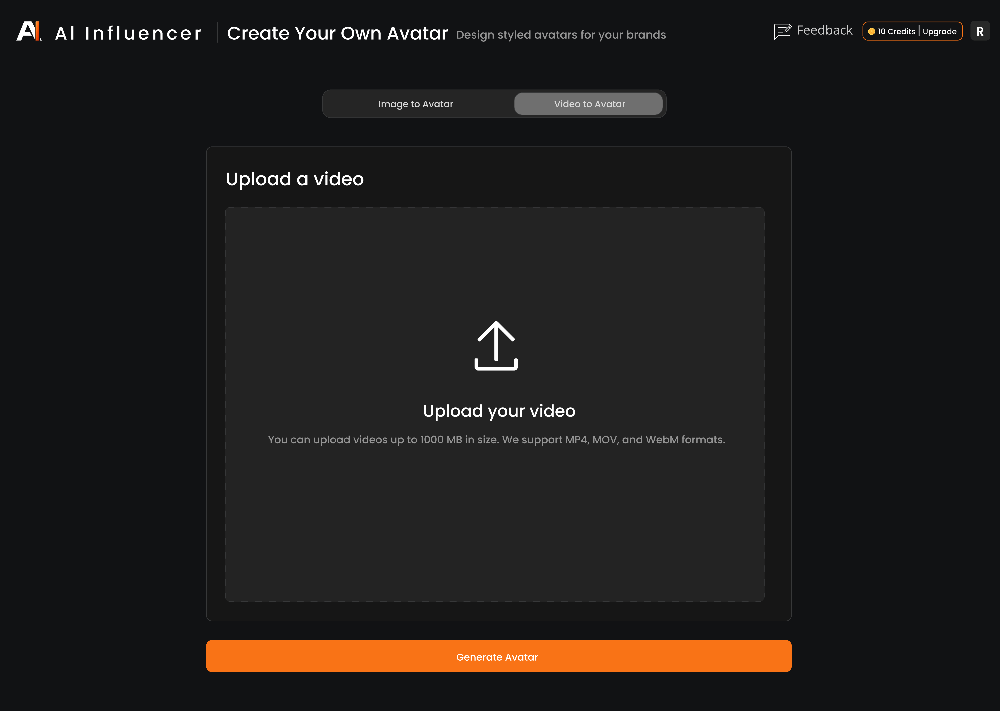
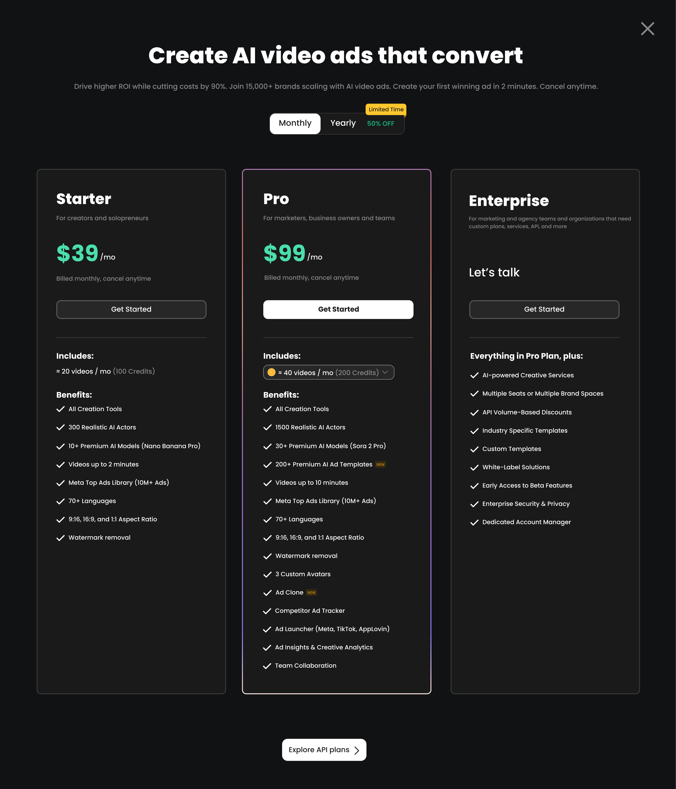
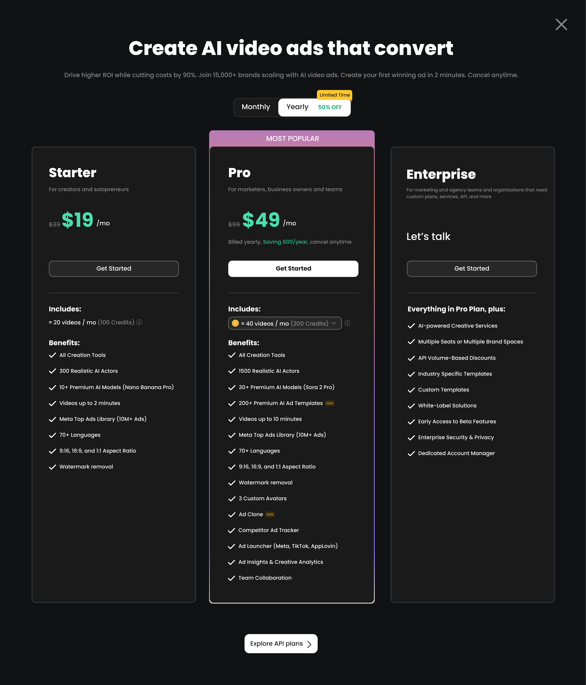
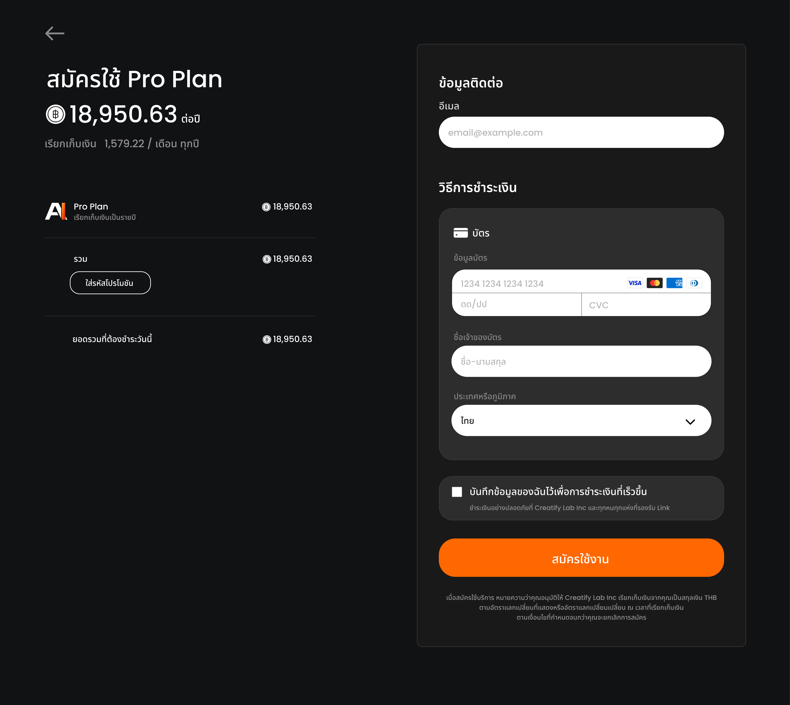
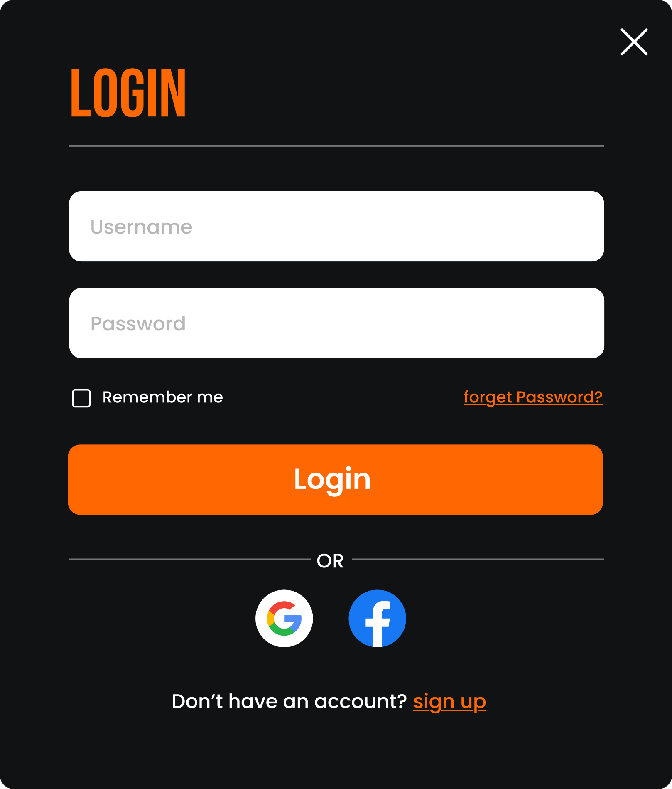
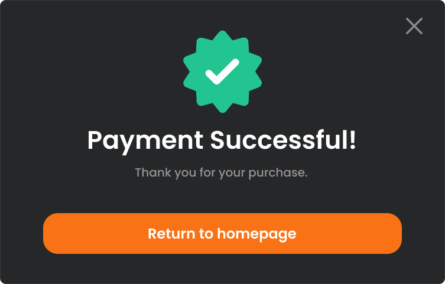

# 🤖 AI-Influencer: Intelligent Ad & Virtual Persona Workspace
> A premium platform for generating high-converting ads, authentic UGC, and next-generation virtual personas.

---

## 📌 Overview
**AI-Influencer** is a centralized Generative AI platform designed specifically for digital marketers, e-commerce brands, and content creators. The application eliminates the traditional friction of ad production by integrating cinematic product photography, short-form video ad generation, UGC style content, and realistic virtual avatars into a single, intuitive, and futuristic dashboard.

### 🎯 Objective
* **Problem:** Brands and agencies face high costs, extensive timelines, and resource constraints when shooting product photography, scouting influencers, and producing the diverse, high-volume video content required to stay relevant on fast-paced social media feeds.
* **Solution:** An all-in-one platform integrating a comprehensive suite of AI tools. Utilizing a clean Grid and Card UI, it effortlessly organizes high volumes of data, scripts, images, and videos—allowing users to search, customize, and generate high-converting ad creatives in minutes.

---

## 🎨 Design Strategy

### 🌌 Visual Style
Designed primarily in Dark Mode, the interface minimizes visual fatigue when working with extensive media grids, while seamlessly making the rich colors of AI-generated product effects and virtual avatars stand out from the background.
* **Typography:** Bebas Neue / Poppins
* **Colors:**
  *  `#111214`
  *  `#F97316` 
  *  `#FFFFFF`
  *  `#B5B5B5`
  *  ( `#FEA05F` `#FF8430` `#FF6800` )
---

### ✨ Key Features

* **URL to Video Ad:** Simply paste a product URL. The AI automatically scrapes the page to extract images, descriptions, and key features, transforming them into a ready-to-use video ad.ล
* **AI Script Writer & Hook Generator:** Generates high-converting ad scripts by analyzing the product and crafting "thumb-stopping" hooks optimized for TikTok, Instagram Reels, and YouTube Shorts.
* **Virtual Avatars & Lip-sync:** Access a diverse library of hyper-realistic digital human avatars that lip-sync naturally to your script, effectively serving as on-screen brand ambassadors without the cost of hiring actors.
* **Text-to-Speech & Voice Cloning:** Converts scripts into professional voiceovers with realistic tones. It supports multiple languages (including Thai) and includes a Voice Cloning feature to establish a unique audio identity for your brand.
* **Batch Mode & Smart Templates:** Features a rich library of pre-designed, high-converting templates. With Batch Mode, users can generate multiple variations of a video (different hooks, avatars, or music) simultaneously for rapid A/B testing.

---
### ⚙️ Platform Workflow
* **Input Data:** Users paste a product link (URL) or upload product images along with a brief description.
* **AI Generation:** The AI processes the assets to draft scripts, create storyboards, and populate the Card UI with initial content variations.
* **Grid Customization:** Users easily tweak details directly through the Grid Dashboard—switching AI avatars, adjusting voiceover tones, changing background music, or editing text overlays.
* **Render & Export:** With a single click, the system renders high-definition videos or images, ready to be deployed across advertising and social media platforms.
---

## 🛠️ Built With
* **Design Tool:** Figma (UI Layout, Prototyping & Grid System)

---

## 📱 Interactive Prototype
Interact with the live prototype and view different component states here:
👉 [**View Figma Prototype**](https://www.figma.com/design/JNiPOCPXuaJUiUynTVrOYP/Al-Influencer--UI-Kits-?node-id=1-2&t=XrUrF3ovQjZKoFqw-1)

---

## 📄 All Pages

  <table>
   <tr align="center">
      <td><b> Home (Before Login) </b></td>
      <td><b> Home (After Login) </b></td>
    </tr>
    <tr>
      <td></td>
      <td></td>
    </tr>
  </table>

  <table>
   <tr align="center">
      <td><b> AI Video Ads </b></td>
      <td><b> AI Avatars </b></td>
    </tr>
    <tr>
      <td></td>
      <td></td>
    </tr>
  </table>

   <table>
   <tr align="center">
      <td><b> Asset Generator - Video (Text to Video) </b></td>
      <td><b> Asset Generator - Video (Image to Video) </b></td>
      <td><b> Asset Generator - Video (Video to Video) </b></td>
    </tr>
    <tr>
      <td></td>
      <td></td>
      <td></td>
    </tr>
  </table>

   <table>
   <tr align="center">
      <td><b> Asset Generator - Image (Text to Video) </b></td>
      <td><b> Asset Generator - Image (Image to Image) </b></td>
    </tr>
    <tr>
      <td></td>
      <td></td>
    </tr>
  </table>

   <table>
   <tr align="center">
      <td><b> Asset Generator - Audio (Text to Music) </b></td>
      <td><b> Asset Generator - Audio (Text to Speech) </b></td>
    </tr>
    <tr>
      <td></td>
      <td></td>
    </tr>
  </table>

   <table>
   <tr align="center">
      <td><b> Soical & UGC ADS (See all) </b></td>
      <td><b> Image Ads (See all) </b></td>
      <td><b> Product Visual Effects (See all) </b></td>
    </tr>
    <tr>
      <td></td>
      <td></td>
      <td></td>
    </tr>
  </table>

   <table>
   <tr align="center">
      <td><b> Market Trends </b></td>
    </tr>
    <tr>
      <td></td>
    </tr>
  </table>

   <table>
   <tr align="center">
      <td><b> Projects </b></td>
      <td><b> Products </b></td>
      <td><b> Avatars </b></td>
    </tr>
    <tr>
      <td></td>
      <td></td>
      <td></td>
    </tr>
  </table>

   <table>
   <tr align="center">
      <td><b> Product Video </b></td>
      <td><b> Ad Clone (Upload Video) </b></td>
      <td><b> Ad Clone (Upload Image) </b></td>
    </tr>
    <tr>
      <td></td>
      <td></td>
      <td></td>
    </tr>
  </table>

  <table>
   <tr align="center">
      <td><b> Create Your Own Avatar (Image to Avatar) </b></td>
      <td><b> Create Your Own Avatar (Video to Avatar) </b></td>
    </tr>
    <tr>
      <td></td>
      <td></td>
    </tr>
  </table>

  <table>
   <tr align="center">
      <td><b> Package (Monthly) </b></td>
      <td><b> Package (Yearly) </b></td>
      <td><b> Payment </b></td>
    </tr>
    <tr>
      <td></td>
      <td></td>
      <td></td>
    </tr>
  </table>

---

## 📤 Pop-up

  <table>
   <tr align="center">
      <td><b> Sign-Up (Pop-up) </b></td>
      <td><b> Login (Pop-up) </b></td>
    </tr>
    <tr>
      <td></td>
      <td></td>
    </tr>
  </table>

  <table>
   <tr align="center">
      <td><b> Sign up Success (Pop-up) </b></td>
      <td><b> Payment Success (Pop-up) </b></td>
    </tr>
    <tr>
      <td></td>
      <td></td>
    </tr>
  </table>
  
  <table>
   <tr align="center">
      <td><b> Soical & UGC Ads (Pop-up) </b></td>
    </tr>
    <tr>
      <td>
      </td>
    </tr>
  </table>

  <table>
   <tr align="center">
      <td><b> Product Visual Effects (Pop-up) </b></td>
    </tr>
    <tr>
      <td>
      </td>
    </tr>
  </table>

  <table>
   <tr align="center">
      <td><b> Image Ads (Pop-up) </b></td>
    </tr>
    <tr>
      <td>
      </td>
    </tr>
  </table>

  <table>
   <tr align="center">
      <td><b> Avatar Showcase (Pop-up) </b></td>
    </tr>
    <tr>
      <td>
      </td>
    </tr>
  </table>

