# 🤖 AI-Influencer: AI-Driven Content & Avatar Studio
> A premium dark-mode interface for generating ads, UGC, and next-generation virtual personas.

---

## 📌 Overview
**AI-Influencer** เป็นแพลตฟอร์มศูนย์รวมเครื่องมือ Generative AI ที่ออกแบบมาเพื่อสายมาร์เก็ตติ้งและครีเอเตอร์โดยเฉพาะ ตัวแอปพลิเคชันช่วยทลายข้อจำกัดในการผลิตสื่อโฆษณา โดยรวมฟีเจอร์การสร้างภาพสินค้าสไตล์ Cinematic, คอนเทนต์ UGC, และการสร้าง Influencer เสมือนจริง (Virtual Avatar) ไว้ใน Dashboard เดียวที่ใช้งานง่ายและดูล้ำสมัย

### 🎯 Objective
* **Problem:** แบรนด์และเอเจนซี่ต้องใช้ต้นทุนและเวลาจำนวนมากในการถ่ายทำ Product Shot, หา Influencer, และผลิตสื่อโฆษณาสำหรับโซเชียลมีเดีย
* **Solution:** ออกแบบแพลตฟอร์มที่รวมทุก AI Tools ไว้ด้วยกัน ใช้ระบบ Grid และ Card UI เพื่อจัดระเบียบภาพและวิดีโอจำนวนมากให้ผู้ใช้ค้นหาและ Generate งานได้อย่างรวดเร็ว

---

## 🎨 Design Strategy

### 🌌 Visual Style: Immersive Dark Mode
เราเลือกใช้ธีม **Dark Mode** เป็นหลัก เพื่อช่วยลดความเมื่อยล้าของสายตาเมื่อต้องทำงานกับรูปภาพจำนวนมาก และช่วยขับเน้นสีสันของผลงาน AI (Product Effects & Avatars) ให้โดดเด่นเด้งออกมาจากพื้นหลัง
* **Typography:** Bebas Neue / Poppins
* **Colors:**
  *  `#111214`
  * 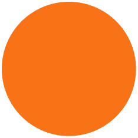 `#F97316` 
  *  `#FFFFFF`
  * 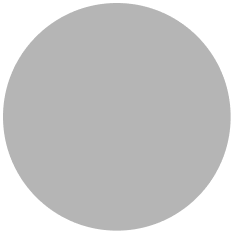 `#B5B5B5`
  * 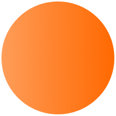 ( `#FEA05F` `#FF8430` `#FF6800` )

### ✨ Key Interface Features
* **Content-Heavy Grid System:** จัดวาง Layout แบบผสมผสาน (Masonry & Standard Grid) เพื่อรองรับภาพหลายสัดส่วน (เช่น แนวตั้งสำหรับ UGC, แนวนอนสำหรับ Ads)
* **Social Media Card View:** ออกแบบ UI ของ "Meta Top Ads" ให้จำลองหน้าตาเหมือนโพสต์โซเชียลมีเดียจริง เพื่อให้ผู้ใช้เห็นภาพผลลัพธ์ก่อนนำไปใช้งาน
* **Categorized Navigation:** แถบเมนูด้านข้าง (Sidebar) ที่แบ่งสัดส่วนชัดเจน ช่วยให้สลับการทำงานระหว่างการสร้าง Avatar, ดู Analytics, และจัดการแคมเปญได้ลื่นไหล

---

## 🚀 Core Platform Features
จากหน้า Dashboard หลัก แพลตฟอร์มรองรับการทำงาน 4 ส่วนสำคัญ:
1. **Social & UGC Ads:** คลังภาพไลฟ์สไตล์และ User-Generated Content ที่สร้างจาก AI
2. **Product Visual Effects:** ระบบ Generate ภาพสินค้าในสภาพแวดล้อมระดับ Cinematic 8K
3. **Meta Top Ads:** ระบบพรีวิวและสร้างโฆษณาที่พร้อมใช้งานบนแพลตฟอร์ม Social Media
4. **Avatar Showcase:** ระบบสร้างและจัดการ Virtual Persona ที่ให้ความสมจริงระดับ Photorealistic

---

## 🛠️ Built With
* **Design Tool:** Figma (UI Layout, Prototyping & Grid System)

---

## 📱 Interactive Prototype
คุณสามารถทดลองใช้งาน Prototype และดู Component States ต่างๆ ได้ที่นี่:
👉 [**View Figma Prototype**](https://www.figma.com/design/JNiPOCPXuaJUiUynTVrOYP/Al-Influencer--UI-Kits-?node-id=1-2&t=XrUrF3ovQjZKoFqw-1)

---

## 📸 All Pages

  <table>
   <tr align="center">
      <td><b> Home (Before Login) </b></td>
      <td><b> Home (After Login) </b></td>
    </tr>
    <tr>
      <td></td>
      <td></td>
    </tr>
  </table>

  <table>
   <tr align="center">
      <td><b> AI Video Ads </b></td>
      <td><b> AI Avatars </b></td>
    </tr>
    <tr>
      <td>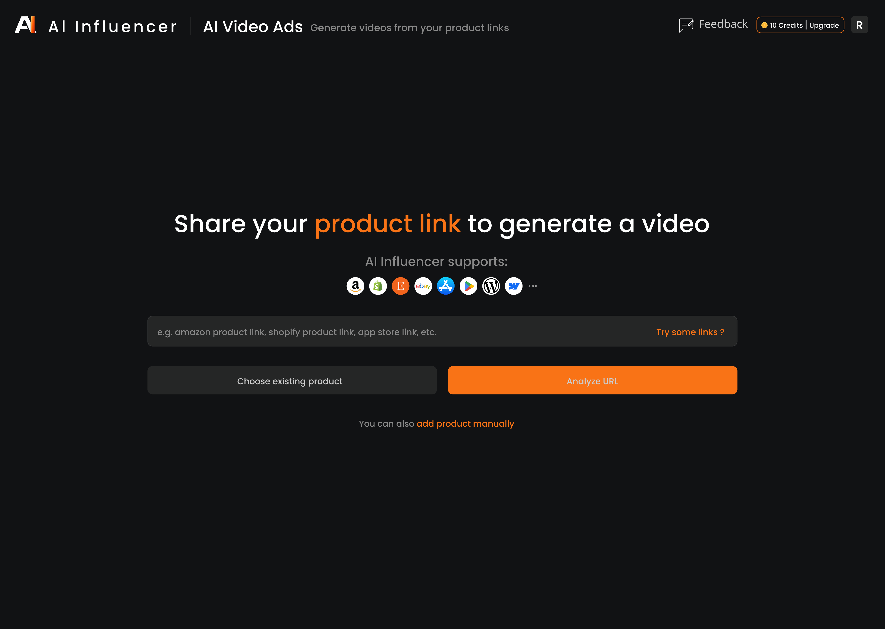</td>
      <td>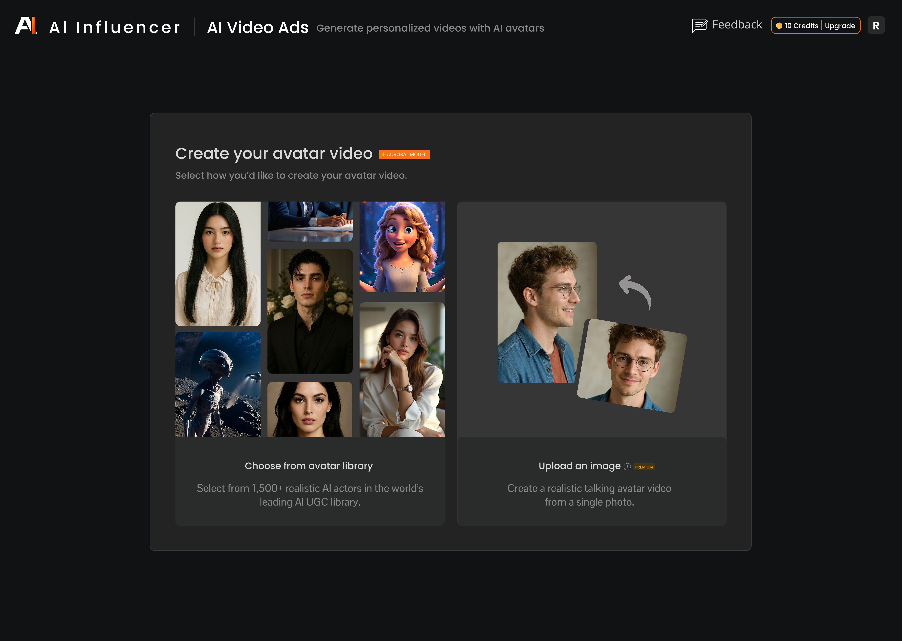</td>
    </tr>
  </table>

   <table>
   <tr align="center">
      <td><b> Asset Generator - Video (Text to Video) </b></td>
      <td><b> Asset Generator - Video (Image to Video) </b></td>
      <td><b> Asset Generator - Video (Video to Video) </b></td>
    </tr>
    <tr>
      <td>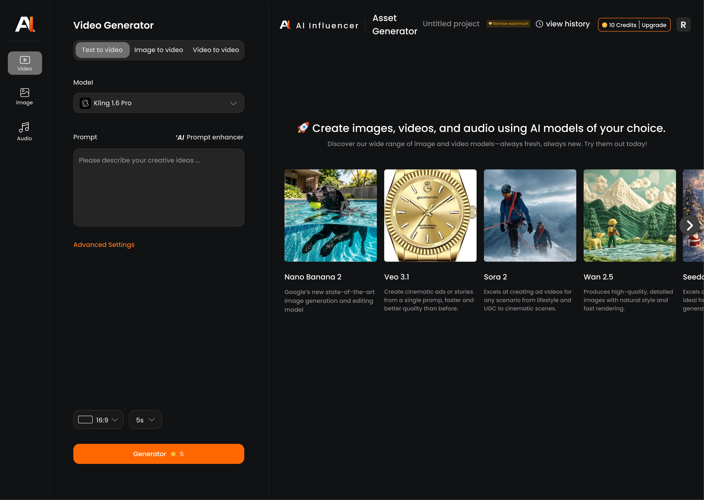</td>
      <td>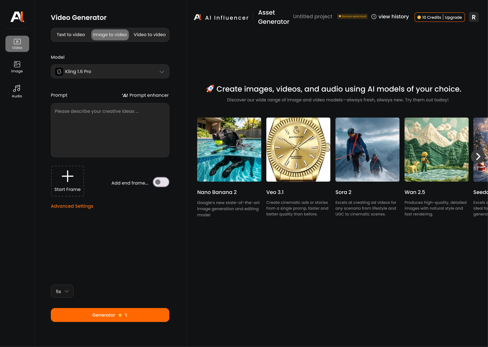</td>
      <td>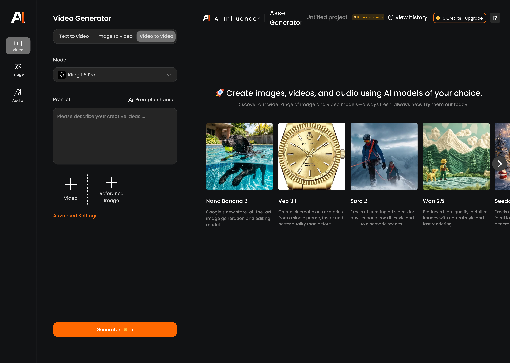</td>
    </tr>
  </table>

   <table>
   <tr align="center">
      <td><b> Asset Generator - Image (Text to Video) </b></td>
      <td><b> Asset Generator - Image (Image to Image) </b></td>
    </tr>
    <tr>
      <td>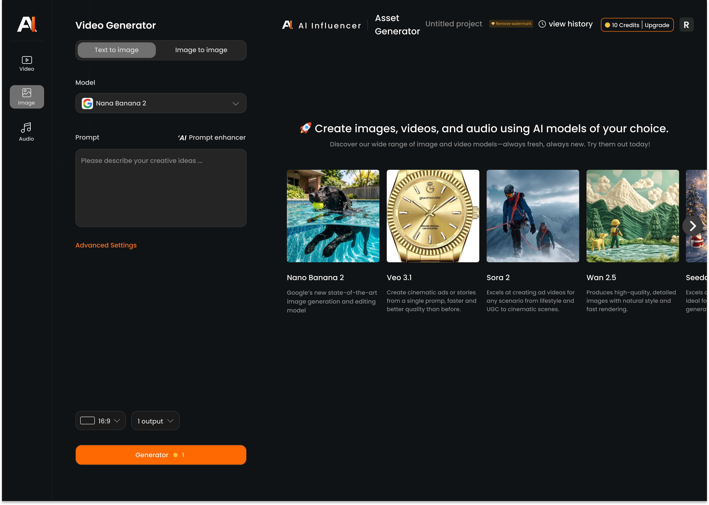</td>
      <td>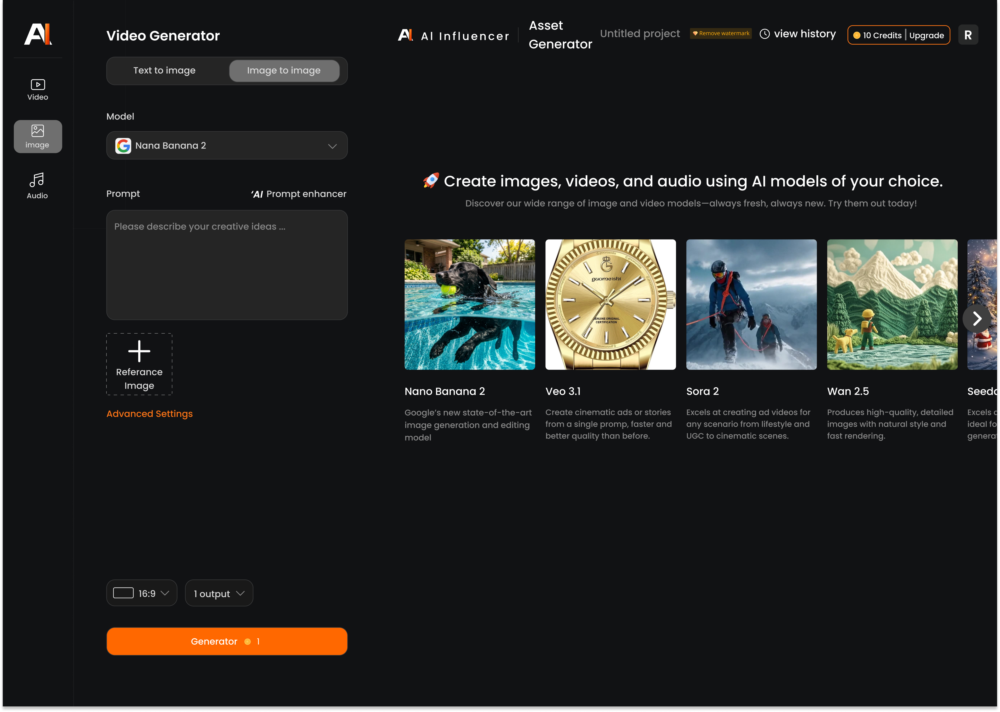</td>
    </tr>
  </table>

   <table>
   <tr align="center">
      <td><b> Asset Generator - Audio (Text to Music) </b></td>
      <td><b> Asset Generator - Audio (Text to Speech) </b></td>
    </tr>
    <tr>
      <td>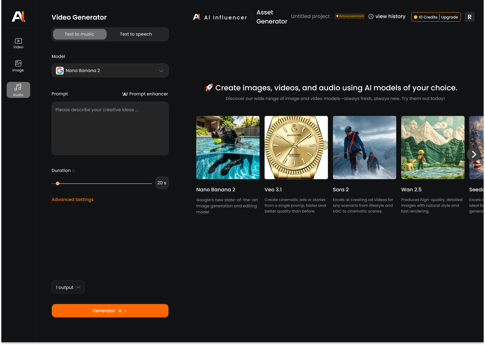</td>
      <td>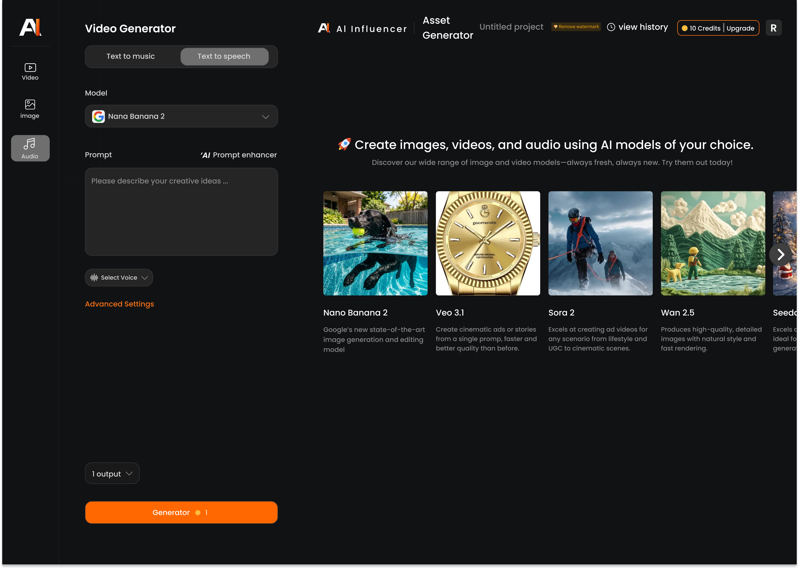</td>
    </tr>
  </table>

   <table>
   <tr align="center">
      <td><b> Soical & UGC ADS (See all) </b></td>
      <td><b> Image Ads (See all) </b></td>
      <td><b> Product Visual Effects (See all) </b></td>
    </tr>
    <tr>
      <td></td>
      <td></td>
      <td></td>
    </tr>
  </table>

   <table>
   <tr align="center">
      <td><b> Market Trends </b></td>
    </tr>
    <tr>
      <td></td>
    </tr>
  </table>

   <table>
   <tr align="center">
      <td><b> Projects </b></td>
      <td><b> Products </b></td>
      <td><b> Avatars </b></td>
    </tr>
    <tr>
      <td>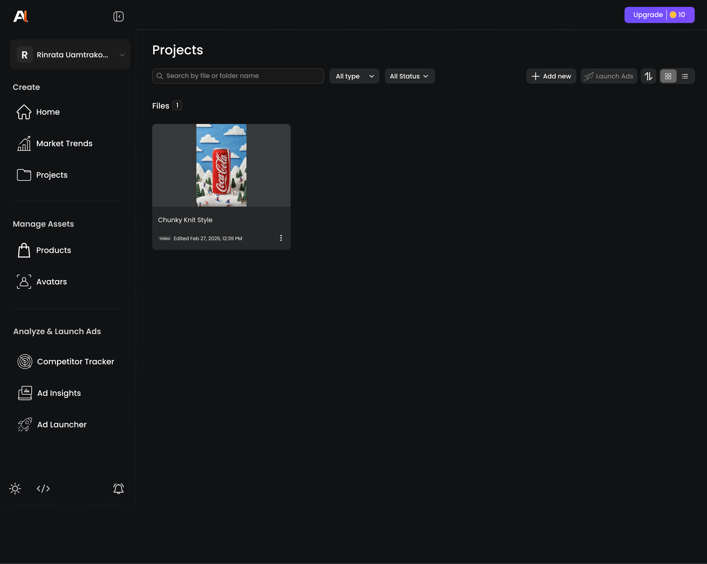</td>
      <td>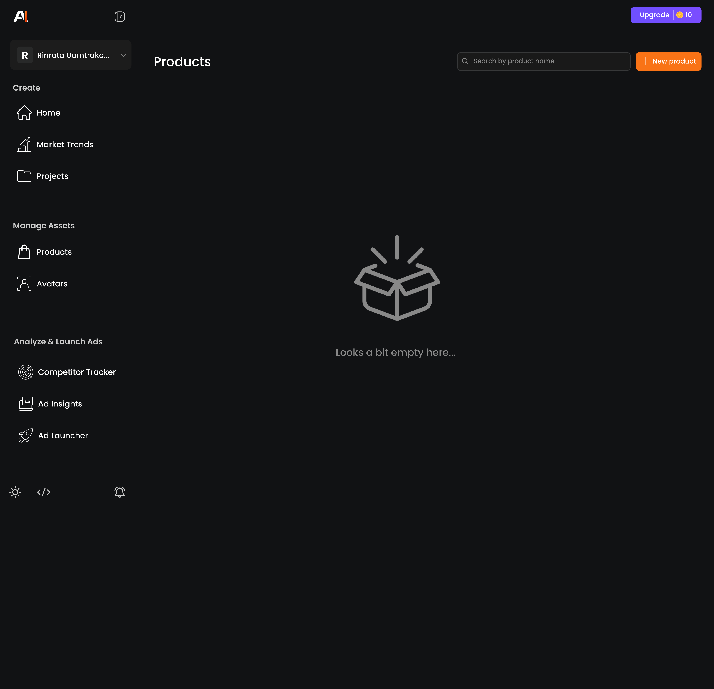</td>
      <td>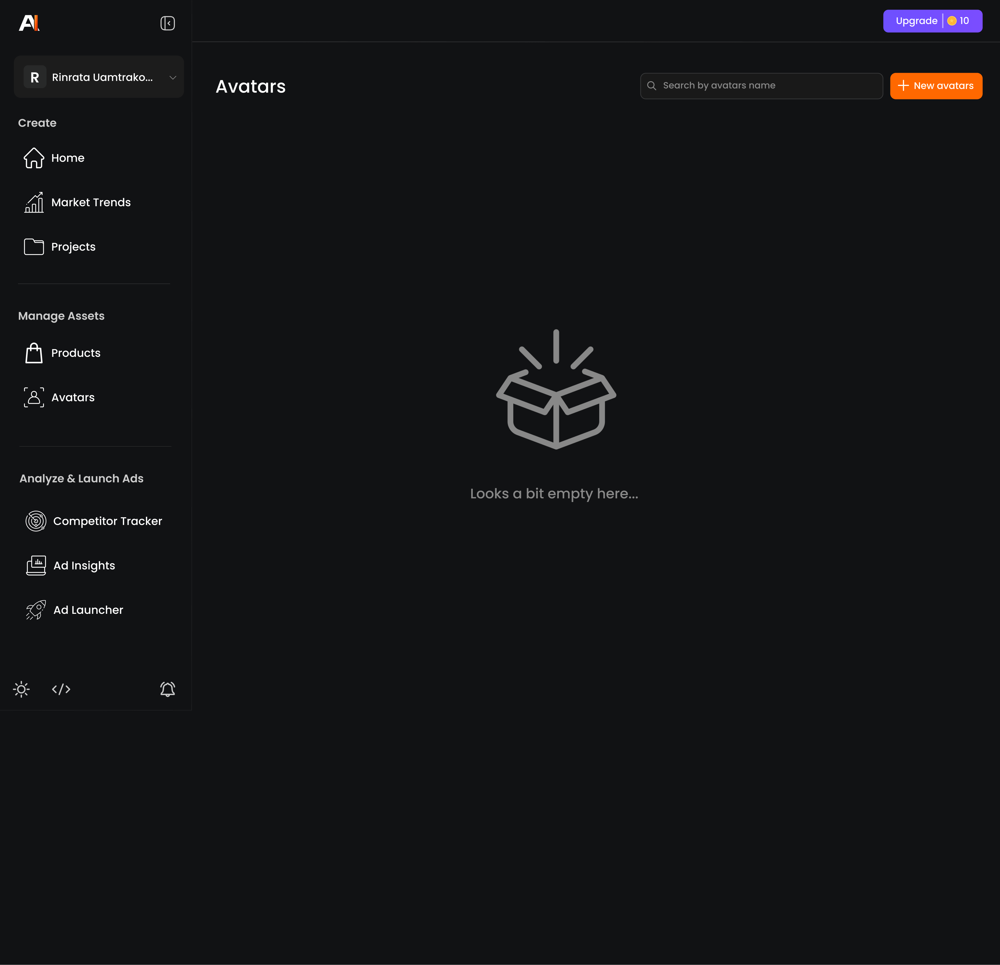</td>
    </tr>
  </table>

---
